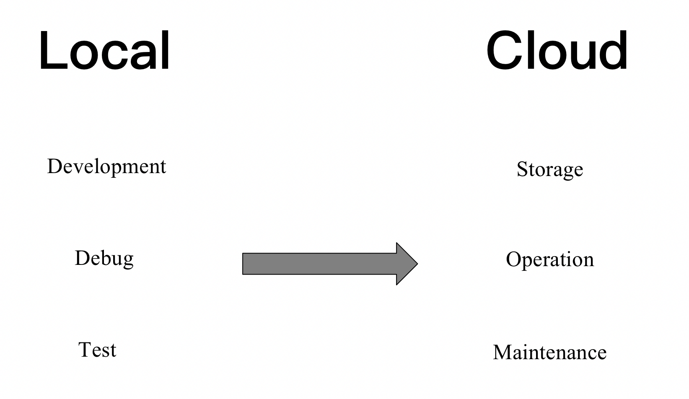
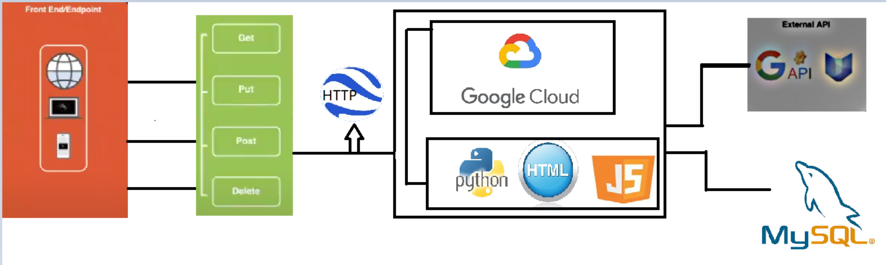
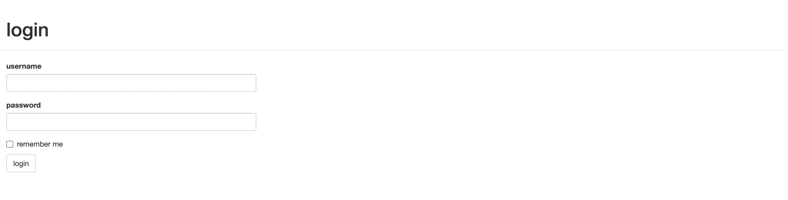
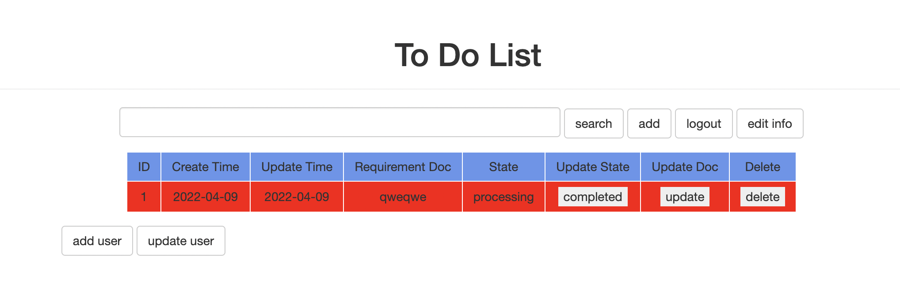
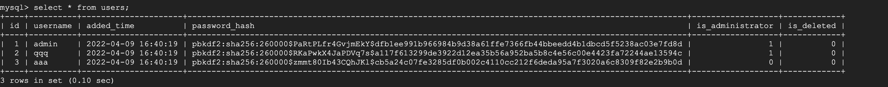
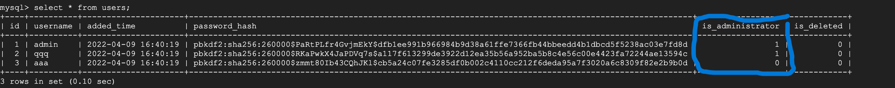
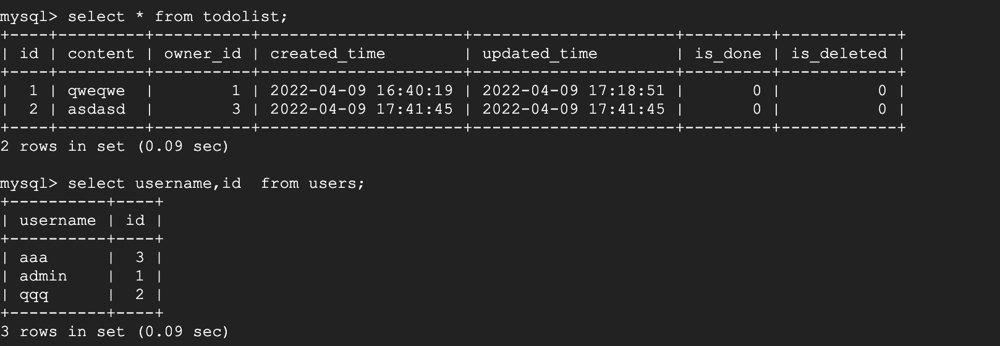
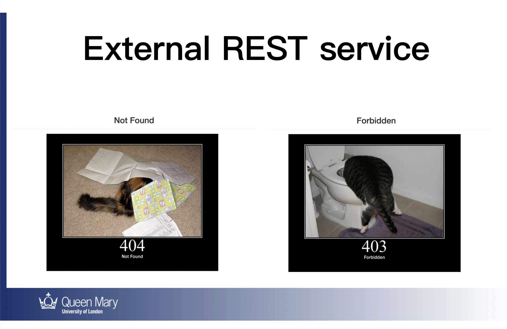

# Demand Management System

#### Background 

In the past two years, due to the covid-19, many people have had to choose to work from home. This has led to inefficiencies in collaborative working, and there is often a lack of clarity in the expression of requirements, failure to keep up to date with work progress, duplication of work and a range of other problems. Therefore, to enable the normal operation of business requirements and to achieve a better management process, we designed a 'demand management system' based on the REST architecture.


#### Introduction 

Demand Management System is a remote demand management system developed using the Python RESTful framework. This system allows for the creation, update, read and delete of users and transactions, as well as calling external REST services to display exception status. as well as calling external REST services to display exception status.


The system was first developed, built, and tested in a local environment, using MySQL to store the data and Hash function to encrypt some sensitive information to ensure data security. After successful local testing, we uploaded the whole system and data to Google Cloud, achieving the advantages of virtualization, high reliability, versatility, and high scalability.



#### Architecture 

The architecture of the whole project is that the user accesses the http URL through various forms of terminals, and then performs a series of transaction operations, and the background system calls get, put, post, delete and other methods to achieve the relevant functions. In case of special circumstances, the system will call the External REST service.



#### Requirement 
``` 
- flask
- flask_login
- flask_sqlalchemy
- flask_bootstrap
- flask_wtf
- wtforms
- werkzeug
- sqlalchemy
``` 

#### Run Command

``` 
python3 run_tdl.py
``` 

#### Function Display

1. Register, log in, update, and delete of users


2. Create, update, and delete of transactions


3. Storage of user password data and encryption methods


4. Securing the database with role-based policies


5. Account-based access management


6. External REST services



